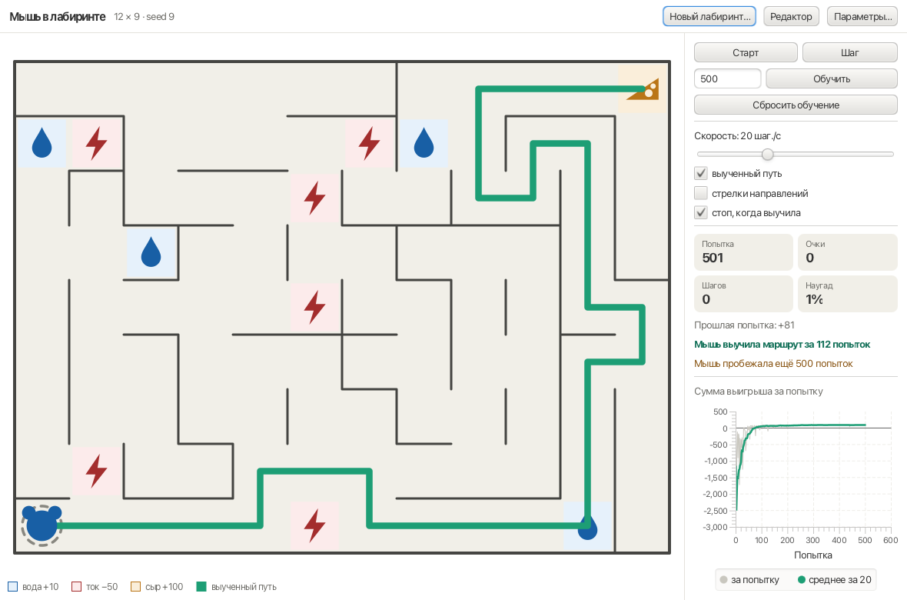
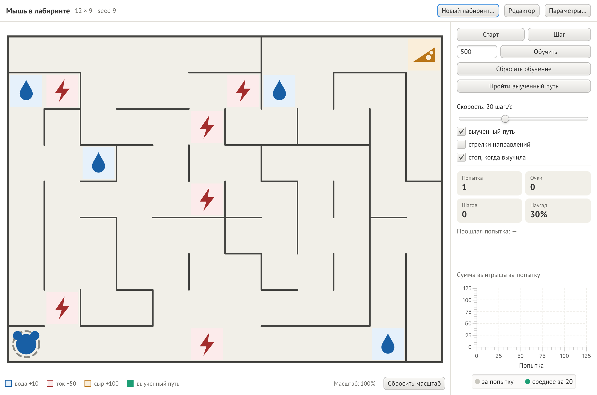
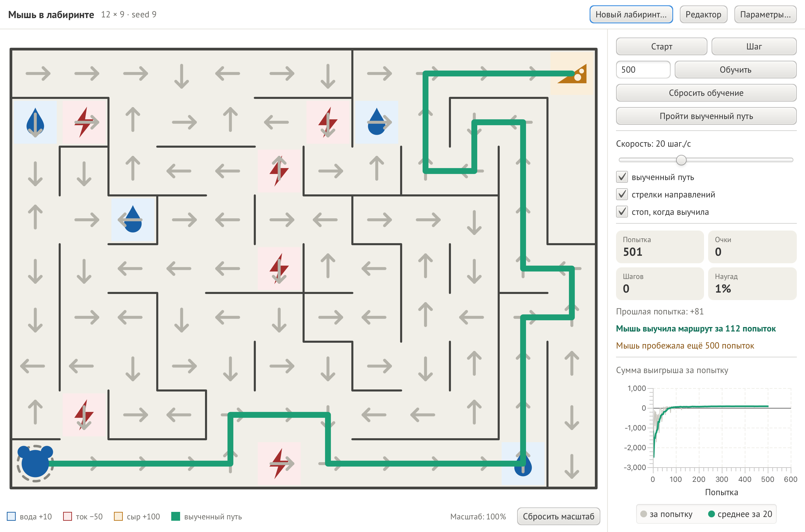
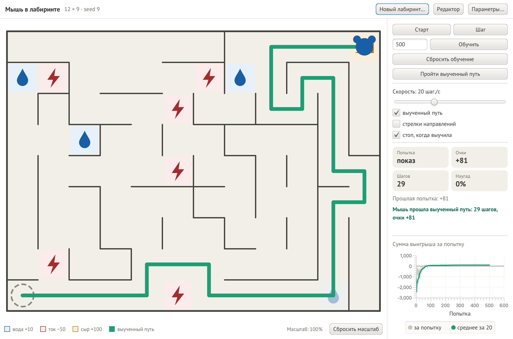
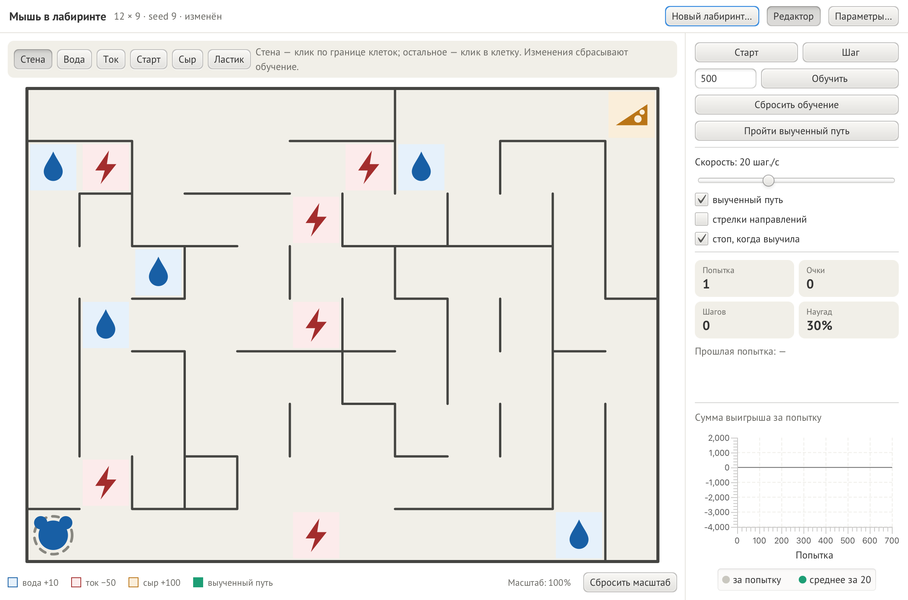
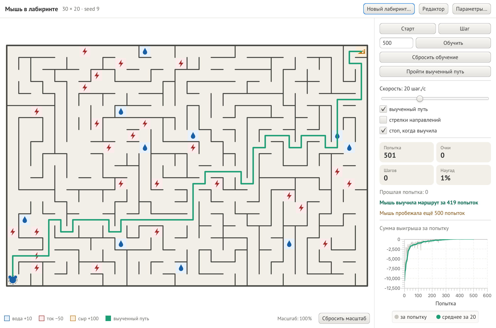
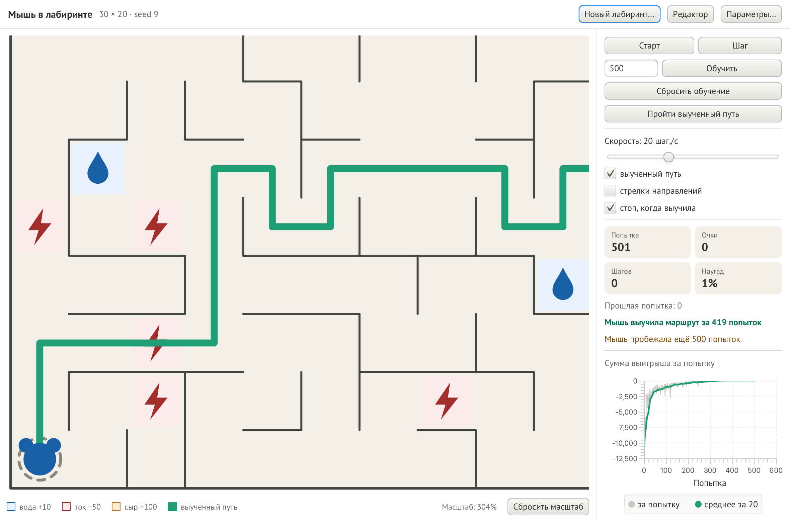
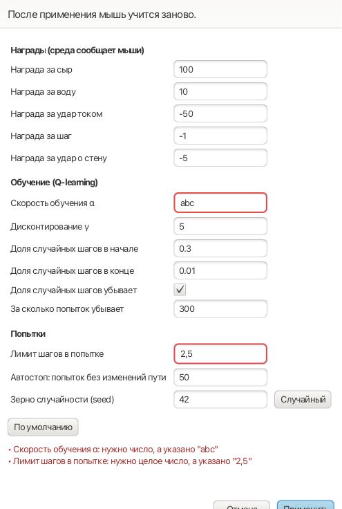
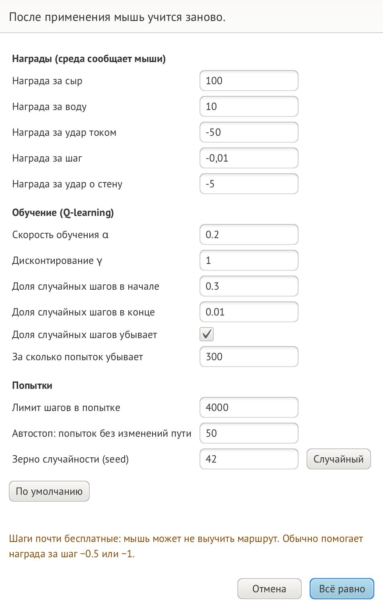

# Мышь в лабиринте

Лабораторная работа № 2 по курсу «ООП на языке Java»: обучение с подкреплением (задача 1.11).

Мышь ищет в конце лабиринта сыр — самую большую награду. По пути она может пить воду (награда поменьше)
и должна избегать электротравмы (штраф). Карты лабиринта мышь не видит: на каждом шаге она выбирает направление,
а среда сообщает ей выигрыш или проигрыш. Из этой обратной связи мышь сама выучивает лучший маршрут.
Мышь всегда знает сумму выигрыша за попытку.

Обучение — алгоритм **Q-learning**. Лабиринт любого размера строится случайно,
размер и схему задаёт пользователь, схему можно исправить мышкой в редакторе.



## Требования

- JDK 25
- Maven 3.9+. Отдельно ставить не обязательно: Maven встроен в IntelliJ IDEA.

Библиотеки (JavaFX 25.0.4, JUnit 6.1.3) Maven скачивает сам при первой сборке.

## Запуск

### Из IntelliJ IDEA

1. Откройте папку проекта. Если IntelliJ не предложил **Load Maven Project**,
   нажмите правой кнопкой на `pom.xml` → **Add as Maven Project**.
2. Вверху справа, в списке запусков, выберите **Окно** и нажмите ▶.
   Настройка лежит в папке `.run/`; в ней уже прописан флаг `--enable-native-access=javafx.graphics`,
   без которого Java печатает предупреждения при старте JavaFX.

### Из терминала

```bash
mvn javafx:run
```

## Как мышь учится

Одна **попытка** — путь мыши от старта до сыра или до лимита шагов. Попыток много; выученное между ними сохраняется.

У мыши есть таблица — «числа на стрелках»: для каждой клетки и каждого из четырёх направлений записана оценка,
сколько очков в сумме мышь получит, если шагнёт туда. Вначале все числа нулевые. После каждого шага мышь подправляет
одно число — у стрелки, по которой прошла:

```
Q[клетка][направление] += α · (награда + γ · лучшее число в новой клетке − Q[клетка][направление])
```

Смысл: «шаг хорош, если за него сразу дали награду или он привёл туда, откуда уже известен хороший путь».
Так ценность сыра с каждой попыткой уходит на шаг дальше от него, пока не дойдёт до старта.

Шаг мышь выбирает так: обычно — по стрелке с самым большим числом, но с вероятностью ε — наугад,
чтобы пробовать новые пути. Доля случайных шагов уменьшается от 30% до 1% за первые 300 попыток.

| Параметр | Что значит | По умолчанию |
|---|---|---|
| α | насколько сильно число сдвигается за один шаг (скорость обучения) | 0.2 |
| γ | какая доля ценности сохраняется за шаг удаления от награды: чем больше лабиринт, тем ближе к 1 | 0.995 |
| ε | доля случайных шагов: в начале → в конце | 0.3 → 0.01 за 300 попыток |
| Лимит шагов | после стольких шагов попытка заканчивается без сыра | 4000 |
| Автостоп | столько попыток подряд лучший путь не должен меняться | 50 |
| seed мыши | зерно случайных шагов мыши (лабиринт задаёт свой seed в «Новый лабиринт…») | 42 |

## Награды

| Событие | Награда по умолчанию |
|---|---|
| Сыр (попытка заканчивается) | +100 |
| Вода (выпивается; в следующей попытке снова на месте) | +10 |
| Удар током (каждый раз) | −50 |
| Каждый шаг | −1 — чтобы короткий путь был выгоднее длинного |
| Удар о стену (мышь остаётся на месте) | −5 |

## Управление

| Элемент | Что делает |
|---|---|
| **Старт / Пауза** | Мышь бегает попытку за попыткой с выбранной скоростью. |
| **Шаг** | Ставит на паузу и делает ровно один шаг. |
| **Обучить N** | Мгновенно прогоняет N попыток (по умолчанию 500, до 100 000; не больше ~5 млн шагов за раз, чтобы окно не зависло). |
| **Сбросить обучение** | Мышь забывает всё выученное; лабиринт остаётся. |
| **Пройти выученный путь** | Мышь идёт по зелёной линии от старта до сыра: без случайных шагов и ничего не выучивая. Скорость — со слайдера. В счётчиках при этом «Попытка: показ», в конце — число шагов и очки. Если мышь ещё не знает пути, кнопка просит сначала её обучить. |
| **Скорость** | От 1 до 5000 шагов в секунду, шкала логарифмическая. |
| **выученный путь** | Зелёная линия: путь мыши без случайных шагов. Рисуется, когда доходит до сыра. |
| **стрелки направлений** | Куда мышь пошла бы из каждой клетки. |
| **стоп, когда выучила** | Пауза, как только лучший путь не менялся 50 попыток подряд (один раз; дальше можно учить мышь и дальше). |
| **Новый лабиринт…** | Размер (до 100×100), сколько воды и тока, процент обходных путей, seed. |
| **Редактор** | Стена — клик по границе клеток; вода, ток, старт, сыр, ластик — клик в клетку. Изменения сбрасывают обучение. |
| **Параметры…** | Награды и параметры обучения. После применения мышь учится заново. |

Лабиринт можно приближать щипком двумя пальцами на тачпаде (или Cmd + колесо, от 100 % до 1600 %)
и двигать двумя пальцами, колесом или перетаскиванием (в редакторе перетаскивание выключено);
текущий масштаб подписан внизу, кнопка **Сбросить масштаб** снова показывает лабиринт целиком.

Справа — номер попытки, очки и шаги текущей попытки, доля случайных шагов, очки прошлой попытки
и график «сумма выигрыша за попытку» (серым — каждая попытка, зелёным — среднее за 20).

## Защита от неверного ввода

Во всех полях программа не падает и объясняет ошибку: пусто, буквы, `1e3`, `NaN`, `Infinity`,
цифры других алфавитов (`٣`, `５`), слишком большие числа, управляющие символы. Дробь можно писать
через точку или запятую. Проверяется и смысл: вода не дороже сыра, ток не награда, α в (0; 1],
воды и тока не больше, чем свободных клеток. Обо всех ошибках сообщается сразу, поля подсвечиваются,
окно не закрывается. На старт и сыр ничего не кладётся, граница лабиринта не стирается.

При γ = 1 и бесплатных шагах мыши всё равно, как долго идти, — такая комбинация запрещена.
При почти бесплатных шагах (шаг 0 или γ ≥ 0.99 при шаге дешевле 0.1) окно предупреждает,
что мышь может не выучить маршрут, и применяет настройки только по второму нажатию.
Причина: мышь не знает, какая дальняя вода уже выпита, и при таких настройках её оценки
раздуваются и ничем не гасятся.

## Параметры по умолчанию

Подобраны перебором: 936 наборов α, γ, ε и лимита шагов на 30 случайных лабиринтах до 20×20.
Проверка на 60 других лабиринтах до 30×30: мышь нашла путь к сыру во всех 60 за 1000 попыток
(со старыми пробными значениями α = 0.5, γ = 0.95 — только в 25).

Лабиринт при запуске — 12×9, seed 9: кратчайший путь к сыру проходит по молнии,
а мышь выучивает обход и заходит за водой.

## Структура

```
src/main/java/maze/
├── Launcher.java             точка входа
├── model/                    модель, ничего не знает об интерфейсе
│   ├── Maze                  лабиринт: клетки, тонкие стены, вода, ток, старт, сыр
│   ├── MazeSpec              заказ на случайный лабиринт + проверка
│   ├── MazeGenerator         обход в глубину + лишние проходы + вода и ток
│   ├── Direction, Position   направления и клетки
│   ├── Settings              награды и параметры обучения + проверка
│   ├── Attempt               среда: одна попытка, награды, выпитая вода
│   ├── QTable                числа на стрелках
│   ├── Mouse                 агент: выбор шага и обучение (Q-learning)
│   └── Trainer               попытки одна за другой, история, автостоп
├── controller/               логика окна без JavaFX
│   ├── TrainingController    старт, пауза, шаг, «обучить N», скорость, автостоп, показ пути
│   ├── MazeEditor            клик → клетка или стена → изменение
│   ├── Viewport              масштаб и сдвиг лабиринта на экране
│   ├── SettingsForm, MazeForm поля окон → Settings / MazeSpec
│   └── SpeedScale, Texts     слайдер ↔ скорость, числа для человека
├── view/                     окно JavaFX: MazeApp, MazeCanvas, ScoreChart, FormDialog, Icons
└── util/SafeText             безопасный показ ввода в сообщениях
```

## Документы

- [Отчёт (Word)](docs/report/Отчет_ЛР2_Минязов.docx) и [PDF](docs/report/Отчет_ЛР2_Минязов.pdf); собирается скриптом `docs/report/build_report.js`
- [Презентация](docs/presentation/Презентация_ЛР2_Минязов.pptx); собирается скриптом `docs/presentation/build_presentation.js`
- UML-диаграммы (PlantUML): `docs/uml`

## Тесты

```bash
mvn test
```

310 тестов на JUnit 6, запускаются в случайном порядке, сами тесты идут меньше секунды.
Главные проверки: мышь обходит ток, если обход дешевле; идёт через ток, если он дешёвый;
делает крюк ради воды; в случайных лабиринтах без карты находит путь той же длины, что поиск по карте;
с параметрами по умолчанию выучивает лабиринты до 30×30, которые не участвовали в подборе.
Логика кнопок, редактора и масштаба проверяется без открытия окна.

## Снимки

| Начало | После обучения, стрелки |
|---|---|
|  |  |

| Показ выученного пути | Редактор |
|---|---|
|  |  |

| Лабиринт 30×20 | Приближение 304 % |
|---|---|
|  |  |

| Ошибки в параметрах | Предупреждение |
|---|---|
|  |  |
